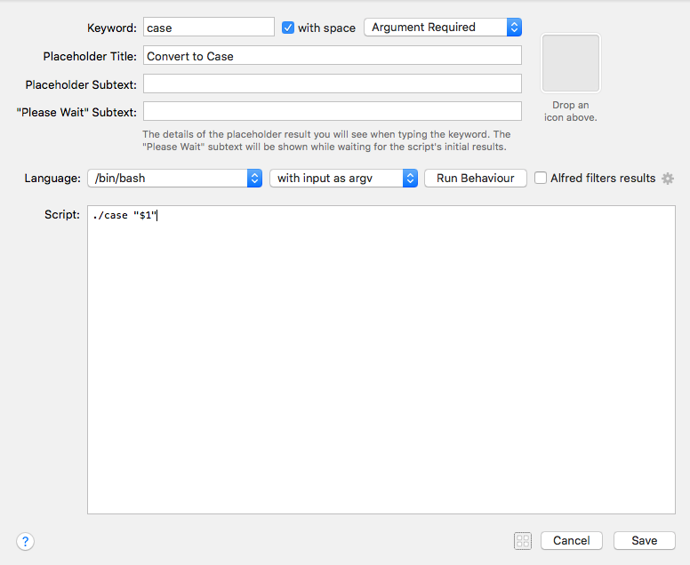
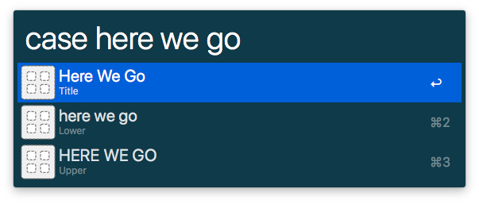
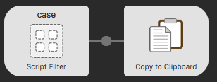
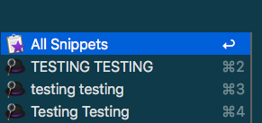

# Alfred Workflow Script Filters in Go

[![GoDoc][godoc-icon]][godoc-link]

This is a lean but comprehensive implementation of the Alfred [Script Filter JSON Format](https://www.alfredapp.com/help/workflows/inputs/script-filter/json/) to get Alfred workflows off the ground quickly with fast, simple script filters in Go that can be easily tested and debugged in `stdout` before importing them to Alfred. 

It uses standard, familiar Go syntax and conventions as much as possible for quick and easy integration with other Go code.

## Full Alfred JSON Support
[full-json.md](full-json.md) is populated with examples of how to use this package to produce the complete JSON output specification on the official Alfred [Script Filter JSON Format](https://www.alfredapp.com/help/workflows/inputs/script-filter/json/) page.

## A Simple Example
Let's say we want to create a simple script filter that converts a given argument to title case, lowercase, or uppercase, which Go conveniently has built-in support to do.

Let's start by prototyping our logic in Go with a `case.go` file in our workflow folder. We can just create a blank script filter for now and fill in the details later. This gives us access to the the workflow folder, where we can place our file.

We can prototype our logic on the command line or in an editor of our choice using pure Go. First we just make sure we have the Alfred JSON right with a simple test for our function:

``` go
package main

import (
	"strings"

	"github.com/drgrib/alfred"
)

func addCases(arg string) {
	// title
	titlecase := strings.Title(arg)
	alfred.Add(alfred.Item{
		Title:    titlecase,
		Subtitle: "Title",
		Arg:      titlecase,
		UID:      "title",
	})
	// lower
	lower := strings.ToLower(arg)
	alfred.Add(alfred.Item{
		Title:    lower,
		Subtitle: "Lower",
		Arg:      lower,
		UID:      "lower",
	})
	// upper
	upper := strings.ToUpper(arg)
	alfred.Add(alfred.Item{
		Title:    upper,
		Subtitle: "Upper",
		Arg:      upper,
		UID:      "upper",
	})
}

func main() {
	arg := "just a test"
	addCases(arg)
	alfred.Run()
}
```
``` json
{
    "items": [
        {
            "uid": "title",
            "title": "Just A Test",
            "subtitle": "Title",
            "arg": "Just A Test"
        },
        {
            "uid": "lower",
            "title": "just a test",
            "subtitle": "Lower",
            "arg": "just a test"
        },
        {
            "uid": "upper",
            "title": "JUST A TEST",
            "subtitle": "Upper",
            "arg": "JUST A TEST"
        }
    ]
}
```

Looks good. Now let's add `os.Args` support and test it on the command line:

``` go
package main

import (
	"os"
	"strings"

	"github.com/drgrib/alfred"
)

// [same stuff in the middle]

func main() {
	arg := os.Args[1]
	addCases(arg)
	alfred.Run()
}
```
``` bash
go build case.go
./case "another test"
```
``` json
{
    "items": [
        {
            "uid": "title",
            "title": "Another Test",
            "subtitle": "Title",
            "arg": "Another Test"
        },
        {
            "uid": "lower",
            "title": "another test",
            "subtitle": "Lower",
            "arg": "another test"
        },
        {
            "uid": "upper",
            "title": "ANOTHER TEST",
            "subtitle": "Upper",
            "arg": "ANOTHER TEST"
        }
    ]
}
```

Right again. Alright. Let's drop this into our script filter now:



And give it a whirl:



And why not copy these to the clipboard so we can actually use them?



With a few simple runs and a glance at the Alfred clipboard history, we can see we are ready for business:



Well that was easy!

[godoc-icon]: https://godoc.org/github.com/drgrib/alfred?status.svg
[godoc-link]: https://godoc.org/github.com/drgrib/alfred